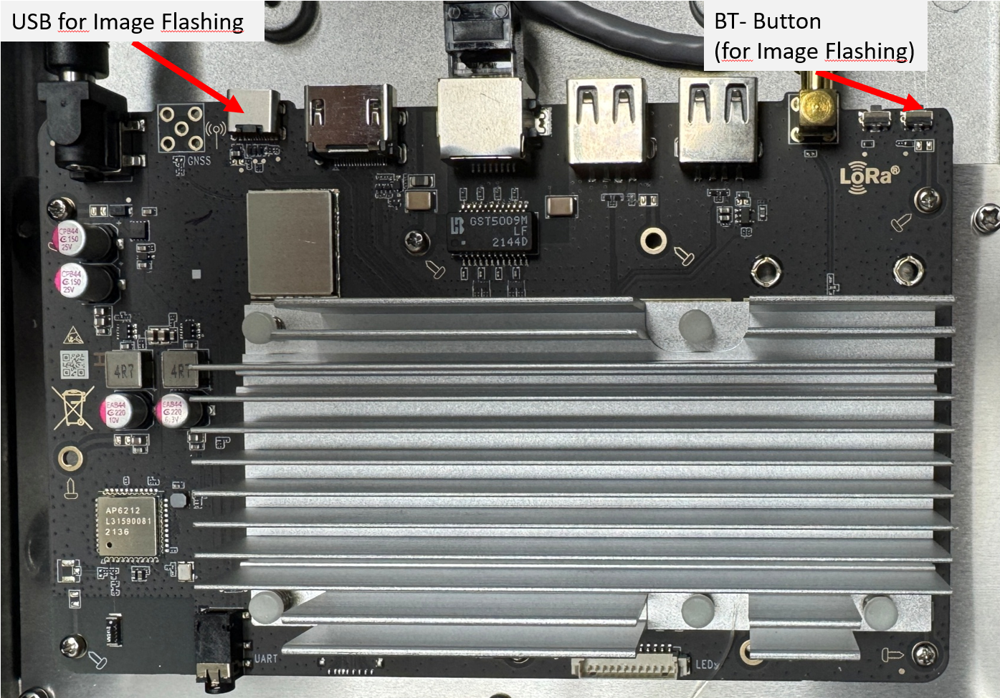

# Flashing LinxdotOS

This guide covers flashing LinxdotOS onto the Linxdot LD1001 (RK3566) hotspot.

## Overview

The Linxdot LD1001 uses a Rockchip RK3566 SoC with 2GB RAM and 32GB eMMC. Flashing is done over USB-C using the Rockchip `rkdeveloptool` while the device is in Loader or Maskrom mode.

**LinxdotOS** is a custom Buildroot-based Linux distribution that runs LoRa Basics Station for TTN, ChirpStack, or any compatible LoRa network server.

## Prerequisites

### Hardware

- Linxdot LD1001 (RK3566 variant, identifiable by the BT-Pair button near the antenna connector)
- USB-C **data** cable (not charge-only)
- A Linux computer (Raspberry Pi, PC, etc.) with a USB port
- Power supply for the Linxdot
- Ethernet cable (for post-flash network access)

### Software

Install `rkdeveloptool` on your Linux machine:

```bash
# Debian/Ubuntu (apt)
sudo apt-get install rkdeveloptool

# Or build from source
git clone https://github.com/rockchip-linux/rkdeveloptool
cd rkdeveloptool
autoreconf -i
./configure
make
sudo cp rkdeveloptool /usr/local/bin/
```

### Image File

Download the latest `linxdot-basics-station.img.xz` from:
- [GitHub Releases](https://github.com/SensorsIot/Linxdot-Hotspot/releases)
- [GitHub Actions Artifacts](https://github.com/SensorsIot/Linxdot-Hotspot/actions)

## Flashing Procedure

### Step 1: Enter Loader Mode

1. Connect the USB-C cable between the Linxdot and your computer

2. With the Linxdot **powered off**, press and hold the **BT-Pair** button

3. While holding the button, plug in the power cable

4. Hold for approximately 5-8 seconds

   

Verify the device is detected:

```bash
lsusb | grep Rockchip
# Should show: Fuzhou Rockchip Electronics Company USB download gadget

sudo rkdeveloptool ld
# Should show: DevNo=1 Vid=0x2207,Pid=0x350a,LocationID=xxx Loader
```

### Step 2: Write the Image

Decompress the image:

```bash
xz -dk linxdot-basics-station.img.xz
```

Write to the device:

```bash
sudo rkdeveloptool wl 0 linxdot-basics-station.img
# Progress will show up to 100%
```

### Step 3: Reset the Device

```bash
sudo rkdeveloptool rd
# Should show: Reset Device OK.
```

The device will now reboot into LinxdotOS.

## Post-Flash Setup

### First Boot

- Connect an ethernet cable to the Linxdot
- The device will obtain an IP via DHCP
- First boot takes 1-2 minutes as it expands the data partition and pulls the Docker image

### SSH Access

```bash
ssh root@<linxdot-ip>
# Default password: linxdot
```

Change the password immediately:

```bash
passwd
```

### Serial Console

The serial console is available at **1500000 baud** on the 3.5mm audio jack (ttyS2):


```bash
picocom -b 1500000 /dev/ttyUSB0
```

### TTN Setup

After first boot, configure Basics Station for TTN. See [BasicsStation.md](BasicsStation.md) for complete instructions:

1. Get the Gateway EUI from `docker logs basicstation`
2. Register the gateway on TTN Console
3. Create an API key
4. Set `TC_KEY` in `/data/docker-compose.yml`

### Region Configuration

Edit `/data/docker-compose.yml` and update `TTS_REGION`:

| Region | Value |
|--------|-------|
| Europe | `eu1` |
| North America | `nam1` |
| Australia | `au1` |

Then restart:

```bash
docker-compose -f /data/docker-compose.yml restart
```

### WiFi Configuration

Edit `/data/etc/wpa_supplicant.conf`:

```
update_config=1
ctrl_interface=/var/run/wpa_supplicant
network={
    scan_ssid=1
    ssid="your_ssid"
    psk="your_password"
}
```

Reboot to apply.

## Troubleshooting

### Can't Enter Flash Mode

- Ensure you are pressing the **BT-Pair** button (small button near the antenna SMA connector)
- The USB-C cable must support data transfer (not charge-only)
- Try holding the button for longer (up to 10 seconds)
- If the device was previously erased, it may enter Maskrom mode automatically without the button

### No Network After Boot

Ensure ethernet is connected before powering on. The device gets its IP via DHCP.

### Gateway EUI Shows eth0 Source

The concentrator was not properly reset. Run:

```bash
docker-compose -f /data/docker-compose.yml down
/opt/packet_forwarder/tools/reset_lgw.sh.linxdot stop
/opt/packet_forwarder/tools/reset_lgw.sh.linxdot start
docker-compose -f /data/docker-compose.yml up -d
```

### Docker Compose Fails on First Boot

This usually means the device had no network during boot. After fixing the network:

```bash
docker-compose -f /data/docker-compose.yml up -d
```

## Alternative: Full Erase Before Flashing

If you encounter issues, do a full erase first:

```bash
# Step 1: Enter Loader mode (hold BT-Pair while powering on)
sudo rkdeveloptool ld
# Should show: Loader

# Step 2: Erase the flash
sudo rkdeveloptool ef
# Wait for "Erasing flash complete."

# Step 3: Power cycle into Maskrom mode
# Unplug power, hold BT-Pair, replug power, hold 5 seconds
sudo rkdeveloptool ld
# Should show: Maskrom

# Step 4: Download bootloader (only needed in Maskrom mode)
sudo rkdeveloptool db rk356x_spl_loader_ddr1056_v1.10.111.bin

# Step 5: Write image
sudo rkdeveloptool wl 0 linxdot-basics-station.img

# Step 6: Reset
sudo rkdeveloptool rd
```

The bootloader file `rk356x_spl_loader_ddr1056_v1.10.111.bin` can be downloaded from [linxdot-rockchip-flash](https://github.com/fernandodev/linxdot-rockchip-flash).

## Credits

- [fernandodev/linxdot-rockchip-flash](https://github.com/fernandodev/linxdot-rockchip-flash) - Linux flashing guide and bootloader
- [xoseperez/basicstation](https://github.com/xoseperez/basicstation-docker) - Basics Station Docker image
